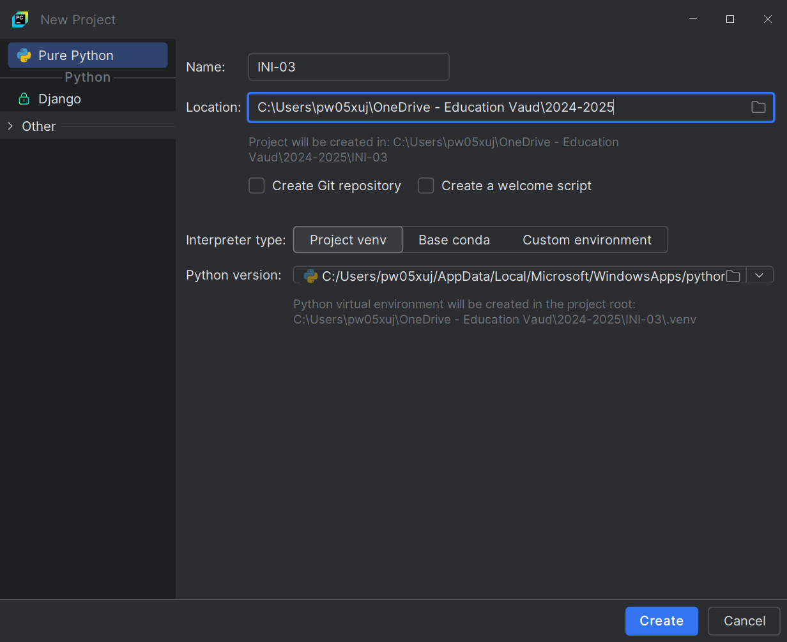
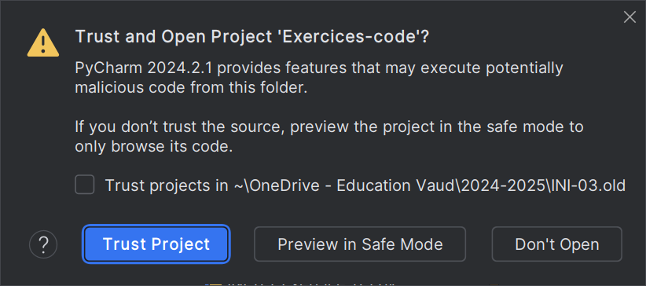

<!-- .slide: data-background="#2d2d2d" -->
# IDE Python
## PyCharm - Installation

 

### Installation utilisant le Centre logiciel
1. Dans la recherche windows taper `Centre logiciel`

1. Choisir `PyCharm Community Edition`
1. Suivre les instructions d'installation.

 

### Installation depuis internet
1. [Télécharger l'installeur de PyCharm Community Edition](https://www.jetbrains.com/pycharm/download/download-thanks.html?platform=windows&code=PCC)

1. Exécuter l'installeur
1. Suivre les instructions d'installation

---

<!-- .slide: data-background="#2d2d2d" -->
# IDE Python
### PyCharm - Présentation

 

## Page d'accueil de PyCharm

 

## Créer un nouveau projet

 

## Microsoft Defender configuration

 

## Interface Projet

 

## Créer un nouveau fichier Python

1. Click droit dans le navigateur de projet
1. Sous-Menu `New`
1. Choisir `Python File`

 

## Ouvrir un ou plusieurs fichiers

1. Click sur le menu `File`
1. Click sur `Open...`
1. Sélectionner le répertoire

 

 

 

 

