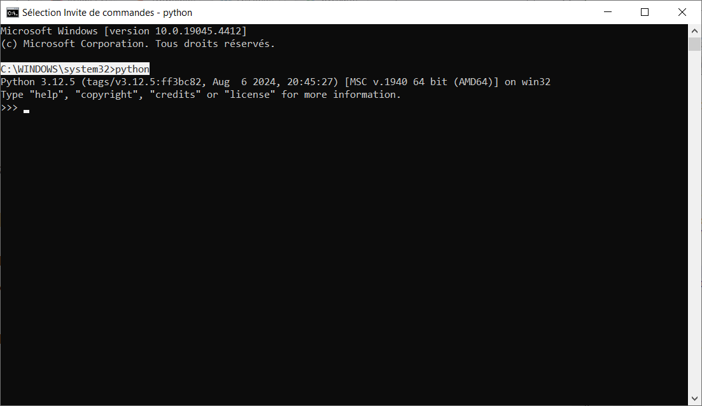
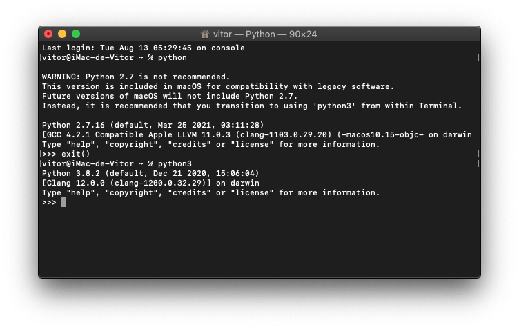
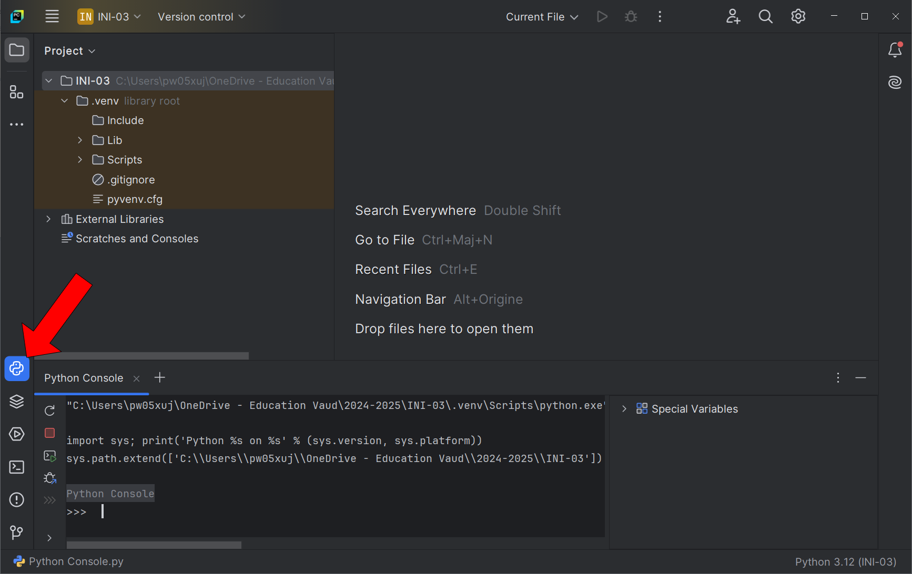

<!-- .slide: data-background="#2d2d2d" -->

# Python

## Console


<br>


## Introduction à la console Python

La console Python est un outil interactif qui permet d'exécuter des commandes et de voir immédiatement les résultats. C’est un excellent moyen de tester des petites portions de code ou de réaliser des calculs rapidement.


<br>


### Comment accéder à la console Python

- **Sous Windows :**
  - Ouvrir le terminal (cmd ou PowerShell).
  - Taper `python` ou `python3` selon la version installée.

.


<br>


- **Sous MacOS/Linux :**
	- Ouvrir le terminal.
  - Taper `python` ou `python3` selon la version installée.

.


<br>


- **Dans l'application PyCharm :**
	- Cliquer sur le bouton `Python Console` 


<br>


Le symbole `>>>` s'affiche lorsqu'on se trouve dans la console Python. C’est le **prompt** de Python, qui attend qu'une commande soit tapée.


```Python
>>>
```

---

<!-- .slide: data-background="#2d2d2d" -->

# Python

## Interagir avec la console Python


<br>

### **Que se passe-t-il si j'entre les chiffres `3+5` ?**

```Python
>>> 3+5
8
```

La console Python donne le résultat du calcul `3+5`. Ce qui signifie qu'elle peut être utilisée comme une simple calculatrice.

<br>

### **Les opérateurs Arithmétiques**

**Essaye ces commandes :**
```Python
>>> 5 - 3
?
>>> 2 * 8
?
>>> 2 ** 8
?
>>> 11.6 / 2
?
>>> 11.6 // 2
?
>>> 11.6 % 3
?
>>> "bon" + "jour"
?
>>> "bon" * 2
?
```

<br>

**Les résultats obtenus :**
```Python
>>> 5 - 3
2
>>> 2 * 8
16
>>> 2 ** 8
256
>>> 11.6 / 2
5.8
>>> 11.6 // 2
5.0
>>> 11.6 % 3
2.5999999999999996
>>> "bon" + "jour"
'bonjour'
>>> "bon" * 2
'bonbon'
```


**Explication :** À chaque fois que vous tapez une commande mathématique dans la console, Python effectue le calcul et affiche immédiatement le résultat.

Note: Rendre attentif au bug des float avec l'arrondi (exemple du 11.6 modulo 3 qui devrait donner 2.6 mais donne 2.5999999999999996 voir [wikipedia](https://fr.wikipedia.org/wiki/Virgule_flottante)

<br>

### **Liste des opérateurs arithmétiques**

| *Opérateur* |	*Nom* | *Type* |	*Exemple* |
|:--:|:---|:--|:--:|
| +  | Addition 	      | entier, réel, string | x + y  |
| -  | Soustraction     | entier, réel | x - y  |
|\*  | Multiplication   | entier, réel, string|	x \* y  |
| /  | Division 	      | entier, réel | x / y  |
| %  | Modulo (reste)   | entier, réel | x % y  |
| \*\* | Puissance      | entier, réel |	x \*\* y |
| // | Division entière | entier, réel |	x // y |


Note: - string = chaine de caractères <br>
 - source [w3schools](https://www.w3schools.com/python/python_operators.asp) & [wikibooks](https://fr.wikibooks.org/wiki/Programmation_Python/Op%C3%A9rateurs)

<br>

### **Déclaration et utilisation de variables**
Qu'est-ce qui se passe lorsqu'on tape les commandes suivantes dans la console ? 

**Exemple :**
```Console PyCharm
>>> x = 10
>>> y = 5
>>> z = x + y
>>> z
15
```

**Explication :** Dans l'exemple ci-dessous, `x` et `y` sont des variables qui stockent des valeurs. Quand on fait `z = x + y`, Python additionne les valeurs de `x` et `y` et les stocke dans `z`. En tapant simplement `z`, la console nous montre le contenu de la variable `z`.

Note: Expliquer que dans la console Python de PyCharm, on peut voir les variables déclarées dans la console, leur type ainsi que les valeurs stockées.

<br>

### **Opérateurs d'assignation**
| *Opérateur* | *Nom* | *Exemple* | *Équivalent à* |
|:------:|:--|:---:|:---:|
| = 	| Égal | x = 5         | x = 5 |	
| += 	| Plus égal | x += 3 	      | x = x + 3 |	
| -= 	| Moins égal | x -= 3 	      | x = x - 3 |	
| \*= | Fois égal | x \*= 3       | x = x \* 3 |	
| /= 	| Divisé égal | x /= 3 	      | x = x / 3 |	
| %= 	| Modulo égal | x %= 3 	      | x = x % 3 |	
| //= |	Divisé entier égal | x //= 3       | x = x // 3 |	
| \*\*= | Puissance égal |	x \*\*= 3   | x = x \*\* 3 	|
| &= 	| *ET* binaire égal | x &= 3 	      | x = x & 3 	|
| \|= 	| *OU* binaire égal | x \|= 3 	    | x = x \| 3 	|
| ^= 	| *OU exclusif* égal | x ^= 3 	      | x = x ^ 3 	|
| >>= |	Décalage à droite égal | x >>= 3       | x = x >> 3 	|
| <<= |	Décalage à gauche égal | x <<= 3 	    | x = x << 3 	|
| := 	| Morse ou walrus | print(x := 3) |	x = 3 <br> print(x) |

Note:  - source [w3schools](https://www.w3schools.com/python/python_operators.asp) & [wikibooks](https://fr.wikibooks.org/wiki/Programmation_Python/Opérateurs)

### **4. Exécution d’instructions pas à pas**
Explique aux élèves que dans la console, on peut exécuter chaque ligne de code individuellement et voir le résultat immédiatement. Cela permet de tester et corriger facilement.

**Exemple :**
```Console PyCharm
>>> nom = "Alice"
>>> age = 12
>>> print(f"Je m'appelle {nom} et j'ai {age} ans.")
Je m'appelle Alice et j'ai 12 ans.
```

**Explication :** Ici, on a stocké le prénom et l’âge dans des variables, puis on les a utilisés dans une phrase avec `print`.

---

### **5. Les erreurs dans la console**
Souligne que faire des erreurs est normal et que la console Python les affichera clairement.

**Exemple d’erreur courante :**
```bash
>>> x = 10
>>> y = "5"
>>> z = x + y
Traceback (most recent call last):
  File "<stdin>", line 1, in <module>
TypeError: unsupported operand type(s) for +: 'int' and 'str'
```

**Explication :** Python ne sait pas additionner un nombre (`x = 10`) et une chaîne de caractères (`y = "5"`). L'erreur nous dit clairement ce qui ne va pas, et on peut la corriger en convertissant la chaîne en nombre avec `int()`.

---

### **6. Comment quitter la console Python**
Il est important d’expliquer comment quitter la console.

- Taper `exit()` ou utiliser le raccourci clavier `Ctrl+Z` puis `Enter` (sur Windows) ou `Ctrl+D` (sur Linux/macOS).

---

### **7. Application pratique : Résolution d’un problème simple**
Pour consolider ce qu'ils ont appris, propose un exercice simple.

**Exercice :**
Demande aux élèves d’utiliser la console pour calculer la somme de deux nombres entrés par l’utilisateur.

```bash
>>> x = int(input("Entrez un nombre : "))
Entrez un nombre : 4
>>> y = int(input("Entrez un autre nombre : "))
Entrez un autre nombre : 5
>>> somme = x + y
>>> print(f"La somme de {x} et {y} est {somme}.")
La somme de 4 et 5 est 9.
```

**Explication :** Ici, on utilise `input()` pour demander à l’utilisateur d’entrer des nombres. Ensuite, on les additionne et on affiche le résultat avec `print()`.

---

### **Conseils pour l'enseignement :**
1. **Montrer en direct :** Si possible, connecte un ordinateur à un projecteur et montre à toute la classe comment utiliser la console.
2. **Encourager l’expérimentation :** Demande aux élèves de tester leurs propres idées dans la console, comme faire d'autres calculs, essayer des chaînes de caractères, etc.
3. **Répétition :** Encourage-les à pratiquer régulièrement pour bien comprendre comment les variables et les commandes Python fonctionnent.

---

En suivant ces étapes, tu pourras introduire la console Python aux élèves de manière interactive et amusante, tout en les rendant à l’aise avec cet outil essentiel.